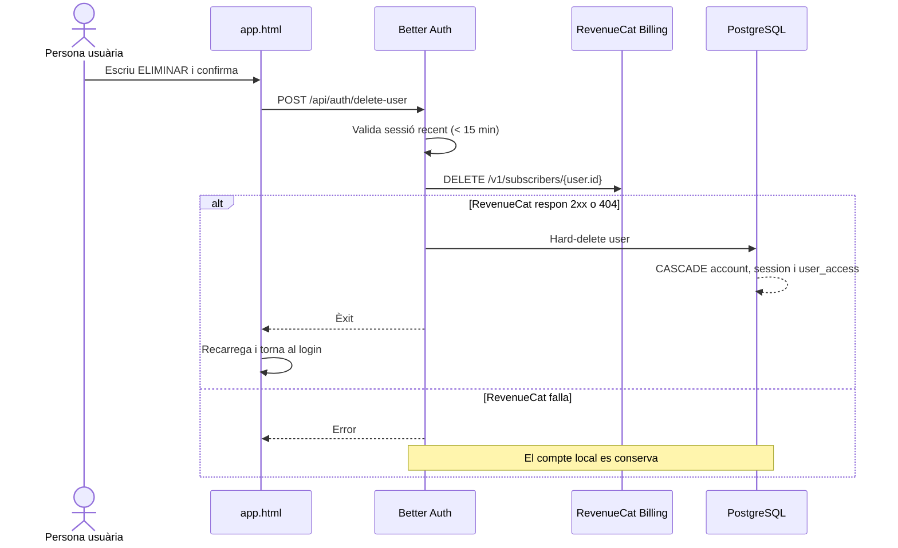

# Eliminació del compte · estat i traspàs

> Foto de l'estat a **2 de setembre de 2026**. Aquest document és el punt de
> partida per reprendre la funcionalitat en una conversa nova. Abans de modificar
> res, cal comprovar l'estat real de Git perquè aquesta branca encara no està
> tancada.

## Resum executiu

L'eliminació autoservei del compte està **implementada i provada localment**, però
encara **no està commitada, pujada ni integrada a `main`**. La implementació viu al
worktree `/private/tmp/boletscat-account-deletion`, branca
`feat/account-deletion`, creada sobre `b116971`.

La persona usuària obre **El teu compte**, desplega **Eliminar el compte**, escriu
literalment `ELIMINAR` i confirma. El backend exigeix una sessió de Better Auth
iniciada durant els darrers 15 minuts, elimina primer el customer de RevenueCat i,
només si aquesta operació acaba correctament o el customer no existia, fa el
hard-delete de la identitat local.

## Estat de Git en aquesta foto

```text
Branca:    feat/account-deletion
Base:      b116971 Regenerate forest grid with area sampling
Worktree:  /private/tmp/boletscat-account-deletion
Main:      encara no conté aquesta funcionalitat
Commit:    pendent
Push:      pendent
Merge:     pendent
```

Fitxers modificats o nous relacionats:

| Fitxer | Funció |
|---|---|
| `src/auth.mjs` | Activa `deleteUser`, sessió recent, rate limit i hook previ |
| `src/revenuecat.mjs` | Elimina el customer de RevenueCat per `user.id` |
| `app.html` | Diàleg de compte, gestió de subscripció i confirmació `ELIMINAR` |
| `legal.html` | Explica la baixa i la possible conservació legal de facturació |
| `test/account-deletion.test.mjs` | Contractes de baixa, errors i cascada local |
| `README.md` | Resum operatiu del flux |
| `PLA_IMPLEMENTACIO.md` | Arquitectura, endpoint i checklist |
| `ESTAT_PROJECTE.md` | Estat general del projecte |
| `.gitignore` | Ajust perquè `node_modules` quedi ignorat també com a symlink del worktree; revisar si s'inclou al commit |

## Contracte funcional acordat

| Decisió | Comportament actual |
|---|---|
| Confirmació | Cal escriure exactament `ELIMINAR` |
| Google o contrasenya | Mateix flux per a tothom; no es demana contrasenya |
| Reautenticació | Better Auth exigeix una sessió de menys de 15 minuts |
| Sessió antiga | No s'esborra res; la UI demana tancar sessió i tornar a entrar |
| Subscripció web | S'elimina primer el customer de RevenueCat Billing, que cancel·la la renovació |
| Error de RevenueCat | Es conserva el compte local; el procés falla tancat |
| Customer inexistent | Un `404` de RevenueCat és segur i permet continuar |
| Dades locals | Hard-delete de l'usuari, comptes vinculats i sessions |
| `user_access` | S'elimina per `ON DELETE CASCADE` |
| Reemborsament | La baixa no tramita automàticament cap reemborsament |
| Accés al perfil | Disponible tant des del mapa com des del paywall |
| Gestió de subscripció | L'enllaç de RevenueCat apareix dins **El teu compte** quan existeix `managementURL` |

No s'ha implementat un flux adaptatiu segons el proveïdor d'autenticació. La sessió
recent és una comprovació comuna i evita inventar una recuperació de contrasenya
per a comptes que només existeixen a Google.

## Flux tècnic



### Endpoint i proteccions

```http
POST /api/auth/delete-user
Origin: https://boletada.cat
Content-Type: application/json

{}
```

- La ruta és la nativa de Better Auth, no un endpoint propi duplicat.
- `session.freshAge` és `15 * 60` segons.
- Rate limit específic: 3 intents cada 600 segons.
- A producció, si falta `REVENUECAT_SECRET_API_KEY`, la baixa falla.
- En desenvolupament sense clau de RevenueCat, la baixa local es pot provar i la
  supressió remota queda marcada com a omesa.

## Què s'esborra i què no

| Sistema | Identificador | Resultat de la baixa |
|---|---|---|
| Better Auth `user` | `user.id`, correu i dades de perfil | Hard-delete |
| Better Auth `account` | Credencial local o vincle Google | Eliminació vinculada a l'usuari |
| Better Auth `session` | Sessions actives | Eliminació vinculada a l'usuari |
| `user_access` | Projecció de `boletada_pro` | `ON DELETE CASCADE` |
| RevenueCat | `app_user_id = user.id` | Customer i historial eliminats |
| Stripe | Pagament, rebut i dades fiscals | No els elimina el codi de Boletada |
| Logs/backups | Segons infraestructura | Pendent de política operativa específica |

No hi ha una taula local de tombstones ni un registre paral·lel d'usuaris
eliminats. Tampoc es conserva localment el correu després de la baixa.

## Reemborsaments després d'eliminar el compte

Aquest és el principal punt que encara s'ha de validar abans de tancar la branca.

En comprar, `app.html` passa `customerEmail: currentUser.email` al Web SDK de
RevenueCat. Després de la baixa, però, el customer i l'historial desapareixen de
RevenueCat i el correu desapareix de PostgreSQL. El pagament hauria de continuar al
compte connectat de Stripe, des d'on es pot cercar i reemborsar.

Flux d'atenció previst per a l'MVP:

1. La persona contacta `hola@boletada.cat` i facilita el correu de pagament o el
   rebut.
2. Es cerca el pagament a Stripe per correu, rebut, import/data o últims quatre
   dígits.
3. El reemborsament es tramita sobre el pagament original des de Stripe.
4. No es recrea el compte de Boletada ni el customer de RevenueCat.

Decisió actual: amb el volum inicial no es crea una segona base de dades de correus
eliminats. Si en el futur cal automatitzar suport, s'hauria de guardar només una
referència mínima de facturació —per exemple `payment_intent_id`, import, data i un
HMAC del correu—, separada de les dades operatives i amb una retenció definida; no
un perfil d'usuari tou.

### Validació pendent obligatòria

- Fer una compra de prova i anotar el pagament/rebut a Stripe.
- Eliminar el compte des de Boletada.
- Confirmar que RevenueCat ha eliminat el customer i cancel·lat la renovació.
- Confirmar que Stripe encara mostra el pagament.
- Confirmar que es pot trobar per `email:` o, com a mínim, pel rebut/ID.
- Tramitar un reemborsament i verificar-ne l'estat.
- Tornar a registrar el mateix correu i confirmar que es crea una identitat neta,
  sense recuperar l'accés anterior.

## Proves executades fins ara

En la darrera validació d'aquesta branca:

```text
npm test               54/54 tests correctes
npm run prepare:public correcte
git diff --check        correcte
```

Els tests nous cobreixen:

- `DELETE` de RevenueCat amb el `user.id` correctament escapat;
- `404` remot com a resultat segur;
- error remot que interromp la baixa;
- activació de Better Auth `deleteUser`;
- sessió recent, rate limit i confirmació literal;
- absència de contrasenya en el formulari;
- eliminació en cascada de `user_access`;
- textos legals i canal de contacte.

Encara no s'ha executat la prova real completa amb RevenueCat Billing i Stripe live
o sandbox després d'aquests canvis.

## Entorn local de demostració

Durant el desenvolupament es va servir una previsualització a
`http://127.0.0.1:8092/app/`. Pot continuar oberta al navegador, però el procés local
no forma part del contracte del repositori i pot haver-se aturat en començar una
conversa nova. La previsualització usa un usuari simulat i no demostra la supressió
real a RevenueCat ni Stripe.

## Abans de fer commit o merge

- [ ] Revisar el diff complet i separar qualsevol canvi que no pertanyi a la baixa.
- [ ] Decidir si l'ajust de `.gitignore` s'inclou al commit.
- [ ] Repetir `npm test`, `npm run prepare:public` i `git diff --check`.
- [ ] Fer QA visual mòbil i escriptori del diàleg des del mapa i el paywall.
- [ ] Fer la validació de compra → eliminació → cerca a Stripe → reemborsament.
- [ ] Confirmar que `REVENUECAT_SECRET_API_KEY` live és present a Coolify.
- [ ] Confirmar que el text legal descriu exactament el comportament desplegat.
- [ ] Només després, fer commit, push i merge a `main` si l'usuari ho demana.

## Com reprendre-ho en una conversa nova

Primer cal localitzar el worktree i inspeccionar-lo, sense assumir que continua
exactament igual que en aquesta foto:

```bash
git -C /Users/xcanchal/Documents/projects/boletscat worktree list
cd /private/tmp/boletscat-account-deletion
git status --short --branch
git diff --stat
npm test
```

Prompt suggerit per a la conversa nova:

> Continua la funcionalitat d'eliminació del compte de Boletada. Llegeix primer
> `ESTAT_ELIMINACIO_COMPTE.md` complet i inspecciona l'estat real del worktree
> `/private/tmp/boletscat-account-deletion`, branca `feat/account-deletion`.
> Conserva les decisions documentades, no facis push ni merge sense que t'ho
> demani i centra't en els pendents de QA i en el recorregut de reemborsament
> posterior a la baixa.

## Fonts externes de referència

- [Better Auth · Users and accounts](https://www.better-auth.com/docs/concepts/users-accounts)
- [RevenueCat · Customer profile and deletion](https://www.revenuecat.com/docs/dashboard-and-metrics/customer-profile)
- [RevenueCat · Refunding payments](https://www.revenuecat.com/docs/web/web-billing/refunding-payments)
- [Stripe · Dashboard search](https://docs.stripe.com/dashboard/search)
- [Stripe · Refunds](https://docs.stripe.com/refunds)
