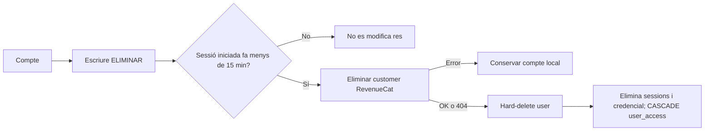

# Estat del projecte · Boletada

> Actualitzat l'**1 de setembre de 2026**. Aquest és el resum operatiu curt; el
> detall d'arquitectura i fases continua a [`PLA_IMPLEMENTACIO.md`](PLA_IMPLEMENTACIO.md).

## Resum executiu

Boletada ja té un vertical web funcional: landing pública, guia SEO, compte,
subscripció anual i predictor privat. El producte està recollint impressions
orgàniques i el següent bloc en validació és el perfil autoservei amb eliminació
del compte.

| Àrea | Estat actual |
|---|---|
| Landing i legal | Publicades; contacte públic `hola@boletada.cat` |
| Guia de bolets | 23 fitxes publicades: 14 comestibles i 9 no comestibles/tòxiques |
| Calendari | Només espècies comestibles o condicionals |
| Predictor | 9 espècies amb mapa i rànquing d'estacions |
| Subscripció web | RevenueCat Billing; preu pioner 19,99 €/any per als primers 100 |
| Autenticació | Better Auth, Google OAuth, verificació de correu, reset i política de contrasenya |
| Perfil | Branca `feat/account-deletion` en validació; encara no és a `main` |
| iOS/Android | Base Capacitor compartida; billing natiu i publicació pendents |

## Predictor i scoring

```text
score = humitat × temperatura × tendència × altitud × hoste × substrat
```

| Component | Implementació |
|---|---|
| Meteorologia | XEMA; pluja ponderada amb retard de fructificació, reserva de 30 dies i temperatura recent |
| Terreny | Graella BGR3 de 250 m amb altitud, substrat i bosc |
| Bosc | Cobertes ICGC 2024: coníferes, caducifolis, esclerofil·les i ribera; estructura densa/clara |
| Sòl | Proxy geològic ICGC 1:250.000: silícic, calcari, mixt o desconegut |
| Temporada | Informativa; no força el score ni provoca salts artificials entre mesos |
| Confiança | `Molt alta` exigeix score ≥ 0,80 i dades completes de bosc, estructura i sòl |
| Dades absents | Es mostren com `Desconegut` i no poden justificar `Molt alta` |

La UI parla de **probabilitat estimada** per ser entenedora, però internament és un
índex heurístic `0..1`, no una probabilitat estadística calibrada. El model és
ecològicament raonable i auditable, però encara necessita observacions reals de
troballes per mesurar precisió, falsos positius i calibrar els llindars.

## Compte i eliminació de dades

La branca `feat/account-deletion` implementa aquest flux:



- RevenueCat Billing cancel·la immediatament la subscripció quan s'elimina el
  customer. Aquest comportament s'haurà de revisar abans d'activar compres natives
  d'Apple o Google, perquè les botigues tenen regles diferents.
- El procés prioritza evitar cobraments orfes: RevenueCat s'elimina abans del compte
  local. Si després fallés PostgreSQL, caldria reintentar la baixa, però la renovació
  ja no continuaria activa.
- Els registres fiscals o de facturació legalment obligatoris poden continuar als
  proveïdors durant el termini exigible.
- La política de privacitat conserva també `hola@boletada.cat` com a canal manual.
- Tots els comptes segueixen el mateix flux: confirmació `ELIMINAR` i sessió
  iniciada durant els darrers 15 minuts. Si és més antiga, cal tornar a entrar amb
  el proveïdor habitual. El diàleg és accessible des del mapa i des del paywall.

## Properes prioritats

1. Completar QA del perfil i eliminació de compte; provar sandbox de punta a punta.
2. Validar correus de verificació i recuperació en producció.
3. Recollir observacions de camp per calibrar l'algorisme.
4. Afegir monitoratge del job diari i antiguitat de prediccions.
5. Preparar billing natiu i QA d'iOS/Android sense assumir que la baixa web cancel·la les botigues.

## Comprovacions habituals

```bash
npm test
npm run prepare:public
node score_estacions.mjs --all --out=private/predictions
```

## Documents canònics

| Document | Finalitat |
|---|---|
| `ESTAT_PROJECTE.md` | Estat curt i properes prioritats |
| `ESTAT_ELIMINACIO_COMPTE.md` | Traspàs autocontingut de la branca de perfil i baixa del compte |
| `README.md` | Model, fonts de dades, execució i desplegament |
| `PLA_IMPLEMENTACIO.md` | Arquitectura, contractes, decisions i checklist complet |
| `content/catalog.json` | Contingut editorial canònic de la guia |
