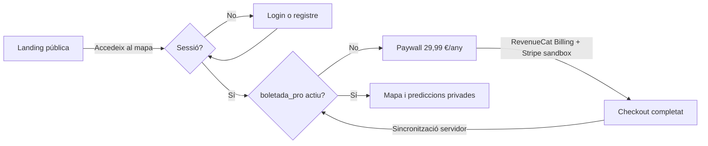

# Pla d'implementació · Boletada

> Estat actualitzat: **2 de setembre de 2026, amb geolocalització i descoberta multiespècie validades en local**

## Objectiu

Convertir l'aplicació actual en un producte de pagament amb:

- landing pública;
- compte d'usuari únic per web, iOS i Android;
- cap accés al mapa ni a les prediccions sense una subscripció activa;
- pagaments natius amb App Store i Google Play;
- pagament web amb Stripe;
- un únic estat d'accés (`pro`) compartit entre plataformes;
- PNG, GeoJSON i JSON protegits pel servidor.

Aquest document és el full de ruta. Cada fase s'ha de completar i validar abans de
començar la següent.

---

## Handoff executiu per reprendre en un context nou

### Punt exacte on som

El vertical web ja funciona **de punta a punta en local/sandbox**:



S'ha comprovat manualment un registre, un pagament de prova de **29,99 € / any** i
el desbloqueig posterior del mapa. El checkout ja mostra EUR i funciona amb
RevenueCat Billing sobre Stripe sandbox. El mapa vectorial i la resolució de la
predicció també s'han validat visualment.

El següent objectiu no és afegir funcionalitats: és **substituir sandbox per live,
validar el correu transaccional, desplegar i fer el smoke test de producció**.

### Estat del repositori en aquest checkpoint

| Element | Estat |
|---|---|
| Branca | `main` |
| Últim commit compartit | `520828c` — `Set annual price to 29.99 EUR` |
| Relació amb remot | `HEAD`, `origin/main` i `origin/HEAD` coincideixen en aquest commit |
| Canvis posteriors | **Locals i encara no committejats/pushed** |
| Fitxers modificats | `.env.example`, `PLA_IMPLEMENTACIO.md`, `app.html`, `favicon.svg`, `index.html`, `scripts/prepare-public.mjs`, `src/config.mjs`, `src/server.mjs` i `.DS_Store` |
| Fitxers nous | `assets/brand/` i `legal.html` |
| Fitxers generats | `public/`, `private/`, `.env` i les prediccions estan ignorats per Git |

`.DS_Store` és soroll local i **no s'ha d'incloure al commit**. Abans de publicar,
cal revisar el diff, preparar `public/`, executar les comprovacions i llavors fer un
sol commit coherent amb la landing, el flux d'accés, legal i billing.

### Verificat en aquesta sessió

| Flux o peça | Resultat |
|---|---|
| `npm run db:migrate` contra Neon de desenvolupament | Correcte; només es va veure l'avís futur de `sslmode` de `pg` |
| Registre amb correu i contrasenya | Correcte en desenvolupament |
| RevenueCat Test Store | Correcte abans de passar al provider web sandbox |
| Producte RevenueCat Billing web | `boletada_annual`, anual, **29,99 EUR** |
| Offering actual | `default`, paquet `$rc_annual` |
| Entitlement | `boletada_pro` |
| Checkout RevenueCat Billing + Stripe sandbox | **Compra completada correctament** |
| Sincronització després de comprar | Correcta; el mapa queda desbloquejat |
| Mapa base | MapLibre vectorial, sense la marca d'aigua `API KEY REQUIRED` de CARTO raster |
| Prediccions | Carregades des de l'API privada; el mapa no rep dades premium abans d'autoritzar |
| Ubicació de l'usuari | A demanda, sense seguiment; marcador propi i popup diferenciat |
| Descoberta multiespècie | Compara rasters, mostra l'espècie dominant per zona i permet obrir-ne el mapa |
| Build públic | `npm run prepare:public` correcte |
| Sintaxi del mòdul JS d'`app.html` | Correcta |
| Estat de càrrega d'accés | Implementat: no mostra login/paywall abans de conèixer sessió i subscripció |

### Decisions que no s'han de reobrir ara

- Llançar primer el **web**; iOS i Android vindran després i no bloquegen el llançament.
- Un sol CTA públic: **«Accedeix al mapa →»**. `/app/` decideix si toca login,
  registre, paywall o mapa.
- Un únic pla anual de **29,99 €**, sense prova gratuïta.
- No demanar el nom en el registre: correu i contrasenya són suficients.
- RevenueCat Billing gestiona el checkout web i Stripe és la passarel·la connectada.
- L'estat d'accés es projecta localment a `user_access`; no hi ha una taula ni un
  endpoint propi de webhooks de RevenueCat. Per a l'MVP es sincronitza després de
  comprar i cada vegada que s'obre l'app.
- No migrar el frontend a React/Next ni afegir infraestructura nova abans de sortir.
- El mapa és una estimació de condicions, mai una garantia de trobar bolets.
- La marca visible dins del mapa és **Boletada** i enllaça a la homepage.

---

## Decisions de producte inicials

| Decisió | Proposta inicial |
|---|---|
| Accés gratuït | Cap: la landing, el registre, el pagament i la restauració són públics; el mapa no |
| Pla | Un únic pla anual |
| Preu web | **29,99 € / any** |
| Prova gratuïta | No |
| Domini i marca | `boletada.cat` · **Boletada** |
| Entitlement de RevenueCat | `boletada_pro` |
| Identificador comú | `Better Auth user.id` = `RevenueCat App User ID` |
| Autenticació MVP | Correu + contrasenya, verificació de correu i recuperació de contrasenya |

### Oferta de llançament — cohort pionera

Per validar la sensibilitat al preu sense complicar el checkout, els primers 100
subscriptors accedeixen a **19,99 € / any** i conserven aquest preu mentre la
subscripció continuï activa. No s'utilitza cap codi promocional ni cal una migració
de base de dades.

| Peça | Contracte |
|---|---|
| Producte pioner RevenueCat Billing | `boletada_annual_pioneers`, anual, 19,99 EUR |
| Producte estàndard | `boletada_annual`, anual, 29,99 EUR |
| Entitlement compartit | `boletada_pro` |
| Paquet publicat durant el llançament | `$rc_annual` → `boletada_annual_pioneers` |
| Tall als 100 | Manual al dashboard de RevenueCat |
| Després del tall | `$rc_annual` → `boletada_annual`; no eliminar ni desassociar el producte pioner |
| Persistència local | Cap canvi; `user_access` continua reflectint l'entitlement actiu |
| Social login | Google implementat al web/PWA amb Better Auth; apps natives pendents de deep links |
| Geolocalització | `On soc ara` implementat sota demanda; sense seguiment ni permís en segon pla |
| Web billing | RevenueCat Billing amb Stripe com a passarel·la |
| Billing natiu | StoreKit a iOS i Google Play Billing a Android, mitjançant RevenueCat |
| Ordre de lliurament | Nucli compartit → web → iOS → Android |

El preu final de cada botiga pot variar lleugerament segons els nivells de preus,
la moneda i els impostos de la plataforma.

---

## Situació actual

- Domini i marca: **Boletada**, desplegada a `boletada.cat`. El domini live encara
  no inclou necessàriament tots els canvis locals descrits en aquest handoff.
- Frontend: landing pública a `/`, predictor protegit a `/app/` i pàgina legal a
  `/legal/`, amb HTML, CSS i JavaScript vanilla.
- Landing: disseny, CTA únic, preu anual, vídeo Remotion, favicon, app icon, logo i
  imatge Open Graph integrats.
- Mapa: MapLibre GL amb mapa base vectorial, predicció forestal superposada,
  ubicació puntual de l'usuari i mode **«Què hi ha ara?»** per comparar espècies.
- Servidor: Node.js 22 + Hono, amb Better Auth, healthchecks, API privada de
  prediccions i sincronització de RevenueCat.
- Dades: PNG, GeoJSON i JSON dins de `private/predictions/`; les antigues URL
  públiques no exposen les prediccions.
- Base de dades: PostgreSQL remot de Neon configurat en desenvolupament i migracions
  aplicades. Falta confirmar backups i entorn definitiu de producció.
- Autenticació: Better Auth amb correu/contrasenya, verificació, recuperació i rate
  limiting. El registre només demana correu i contrasenya. A desenvolupament la
  verificació està desactivada; a producció s'activa per defecte o explícitament amb
  `REQUIRE_EMAIL_VERIFICATION=true`.
- Correu: Resend escollit i adaptador implementat; falta validar enviament real de
  verificació i recuperació amb el domini `boletada.cat` i confirmar que
  `suport@boletada.cat` rep correu.
- Subscripcions: RevenueCat Billing sandbox connectat a Stripe sandbox, producte
  `boletada_annual` a **29,99 € / any**, paquet `$rc_annual`, offering `default` i
  entitlement `boletada_pro` configurats.
- Flux web: login, registre, paywall, compra i sincronització implementats. La compra
  sandbox s'ha completat i ha desbloquejat el mapa. En entrar, una vista de càrrega
  evita el flaix incorrecte de login/paywall mentre es comproven sessió i accés.
- Legal: avís legal, privacitat i termes publicats en una pàgina única; contingut
  funcional amb Xavier Canchal i `xaviercanchal@gmail.com`, avís explícit que no es
  garanteixen troballes i desistiment de 14 dies. Pendent de revisió jurídica si es
  vol reforçar abans d'escalar.
- Mòbil: Capacitor 8 comparteix la interfície, però compres/restauració natives i QA
  d'iOS/Android continuen pendents.

---

## Arquitectura objectiu

```text
Landing pública              App web / iOS / Android
      |                                 |
      |                       cookie web / token natiu
      +----------------------+----------+
                             |
                       Node.js + Hono
                      /       |         \
             Better Auth   autorització  fitxers privats
                  |          `pro`       PNG/GeoJSON/JSON
              PostgreSQL       |
                               |
                         RevenueCat
                      /      |       \
                 App Store  Play    Stripe
```

### Regla d'autorització

Una petició de predicció només s'accepta si es compleixen les dues condicions:

```text
sessió Better Auth vàlida AND entitlement RevenueCat `boletada_pro` actiu
```

- Sense sessió: `401 Unauthorized`.
- Amb sessió però sense `pro`: `402 Payment Required`.
- Amb sessió i `pro`: es retorna el recurs.

---

## Resum de fases

| Fase | Resultat | Estat |
|---|---|---|
| 0 | Baseline, decisions i entorns preparats | Desenvolupament preparat; producció pendent |
| 1 | Backend Hono + PostgreSQL + Better Auth | Web complet; token natiu pendent |
| 2 | PNG/GeoJSON fora de `public/` i API protegida | Web complet; clients natius pendents |
| 3 | Login i bloqueig complet al web i a Capacitor | Web complet; Capacitor pendent |
| 4 | RevenueCat Billing: web complet de punta a punta | **Sandbox E2E validat**; live pendent |
| 5A | iOS: compra nativa i restauració | Pendent |
| 5B | Android: compra nativa i restauració | Pendent |
| 6 | Landing, paywall i vídeo promocional definitius | Fet per al web; botons de botigues pendents |
| 7 | Seguretat, observabilitat, desplegament i llançament | Pendent |

---

## Fase 0 — Baseline i preparació

### Feina

- [x] Confirmar domini públic: `boletada.cat`; API servida al mateix origen.
- [x] Confirmar el nom comercial definitiu: **Boletada**.
- [x] Confirmar **29,99 € / any**, sense pla gratuït ni prova.
- [ ] Tancar la separació definitiva entre desenvolupament i producció.
- [ ] Crear PostgreSQL a Coolify amb volum persistent i còpies de seguretat.
- [ ] RevenueCat i Stripe sandbox configurats; App Store Connect, Google Play i
  credencials live continuen pendents.
- [x] Escollir Resend com a proveïdor de correu transaccional.
- [x] Documentar les variables d'entorn necessàries sense versionar cap secret.
- [ ] Fer una prova de fum de l'app web, iOS i Android actual abans de modificar-la.

### Variables previstes

```text
DATABASE_URL
BETTER_AUTH_SECRET
BETTER_AUTH_URL
EMAIL_PROVIDER_API_KEY
REVENUECAT_SECRET_API_KEY
REVENUECAT_IOS_PUBLIC_API_KEY
REVENUECAT_ANDROID_PUBLIC_API_KEY
REVENUECAT_WEB_PUBLIC_API_KEY
```

### Criteri de sortida

- PostgreSQL és persistent i té backup.
- Els quatre comptes externs existeixen.
- Domini, nom i preu estan decidits.
- L'estat actual es pot executar i provar abans de començar la migració.

---

## Fase 1 — Backend i autenticació

### Implementació

- [x] Introduir Hono com a router HTTP mantenint Node.js i Docker.
- [x] Separar el servidor en mòduls (`server`, `auth`, `database`, accés, correu i billing).
- [x] Connectar Better Auth a PostgreSQL.
- [x] Generar i aplicar les migracions de Better Auth i de `user_access`.
- [x] Muntar Better Auth a `/api/auth/*`.
- [x] Habilitar registre, login, logout, verificació de correu i recuperació de
  contrasenya.
- [x] Usar cookies gestionades per Better Auth amb configuració diferenciada per entorn.
- [ ] Preparar autenticació amb token per a Capacitor i guardar-lo al magatzem segur
  del sistema, no en text pla ni dins dels fitxers de l'app.
- [x] Configurar orígens explícits; eliminar CORS global amb `*`.
- [x] Afegir rate limiting als endpoints sensibles d'autenticació.
- [x] Crear `/api/me` amb sessió i estat d'accés.

### Decisions tècniques

- No es migrarà a Next.js, React ni un altre framework de frontend.
- Better Auth no substituirà RevenueCat: només identifica l'usuari i gestiona la
  sessió.
- El `user.id` creat per Better Auth serà l'identificador estable compartit amb
  RevenueCat.

### Taules actuals de PostgreSQL

| Taula | Propietari lògic | Per a què serveix |
|---|---|---|
| `user` | Better Auth | Identitat mínima: correu, verificació i camps interns |
| `account` | Better Auth | Credencial/proveïdor associat al compte |
| `session` | Better Auth | Sessions web actives |
| `verification` | Better Auth | Tokens temporals de verificació/reset |
| `rateLimit` | Better Auth | Comptadors persistents contra abús d'auth |
| `user_access` | Boletada | Projecció mínima de `boletada_pro` i venciment |

No hi ha `revenuecat_webhook_events`: es va descartar perquè l'MVP no consumeix
webhooks i la taula no aportava valor sense aquest flux.

### Proves

- [x] Crear un compte i iniciar sessió al web de desenvolupament.
- [ ] Verificar un correu real i tancar/reobrir sessió amb verificació obligatòria.
- [ ] Recuperar una contrasenya.
- [ ] Rebutjar una sessió caducada o manipulada.
- [ ] Autenticar una instal·lació iOS i una Android.
- [ ] Comprovar que no hi ha secrets dins del bundle web o natiu.

### Criteri de sortida

Un mateix usuari pot iniciar sessió al web, iOS i Android amb el mateix `user.id`.
Encara no hi ha pagaments, però la identitat és estable i persistent.

---

## Fase 2 — Protecció real de PNG, GeoJSON i JSON

### Implementació

- [x] Crear `private/predictions/` fora de `public/`.
- [x] Canviar el procés inicial perquè el scorer escrigui a la
  carpeta privada.
- [x] Deixar dins de `public/` només la landing i els recursos realment públics.
- [x] Crear endpoints autenticats per obtenir:
  - metadades i graella;
  - PNG per espècie;
  - GeoJSON per espècie;
  - qualsevol altre fitxer de predicció.
- [x] Validar el nom de recurs contra una llista permesa; mai concatenar
  una ruta arbitrària enviada pel client.
- [x] Enviar `Cache-Control: private` i evitar que un CDN desi respostes premium com
  a públiques.
- [x] Adaptar MapLibre perquè carregui les dades autenticades.
- [ ] Evitar URL signades llargues o permanents. Si s'introdueix CDN, fer-les caducar
  al cap de pocs minuts.
- [x] Eliminar les antigues URL públiques.

### Proves

- [ ] Una petició anònima a un PNG/GeoJSON retorna `401`.
- [ ] Una ruta amb `../` o codificacions equivalents no pot sortir de la carpeta.
- [ ] El mapa web carrega totes les espècies amb una sessió vàlida.
- [ ] iOS i Android carreguen els recursos amb el token natiu.
- [ ] Un reinici o redeploy regenera les dades sense fer-les públiques.

### Criteri de sortida

No queda cap predicció sota una URL pública. En aquesta fase es pot utilitzar un
usuari de prova autoritzat manualment; el control de subscripció arriba a la fase 4.

---

## Fase 3 — Flux d'accés i hard paywall

### Pantalles/estats

- [x] Landing pública.
- [x] Registre i login.
- [x] Verificació de correu i recuperació de contrasenya.
- [x] Paywall obligatori per a usuaris sense `pro`.
- [x] Estat de càrrega mentre es verifica la subscripció.
- [x] Controls mínims de compte dins del mapa: correu, gestió de subscripció i logout.
- [ ] Eliminació del compte i canal d'ajuda visible, si es considera imprescindible
  per al llançament web o abans de publicar les apps natives.
- [x] Estat d'error o servei no disponible que no desbloquegi contingut per accident.

### Regla visual i tècnica

No n'hi ha prou amb ocultar el mapa amb CSS. El client no ha de demanar ni rebre cap
dada premium fins que el servidor hagi autoritzat la petició.

### Màquina d'estats actual de `/app/`

| Estat comprovat | Vista | Dades premium |
|---|---|---|
| Encara desconegut | Radar de Boletada: «Comprovant l'accés…» | No es demanen |
| Sense sessió | Login o registre segons `?mode=signup` | No es demanen |
| Enllaç de recuperació | Formulari de nova contrasenya | No es demanen |
| Sessió vàlida, sense `boletada_pro` | Paywall anual | No es demanen |
| Sessió i `boletada_pro` actiu | Mapa complet | Sí, via `/api/predictions/:filename` |
| Error d'auth o billing | Banner prominent i localitzat dins la vista corresponent | No es desbloquegen |

L'HTML inicial mostra el loader i manté amagats login i paywall. La sincronització
amb RevenueCat acaba abans de decidir quina vista ensenyar: el paywall no es renderitza
provisionalment mentre es comprova una subscripció. `/app/` també respon amb
`Cache-Control: no-store` perquè el navegador no recuperi una captura antiga del
formulari. El loader respecta `prefers-reduced-motion`.

### Proves

- [x] Usuari no autenticat: només veu landing/login.
- [x] Usuari autenticat sense `pro`: només veu paywall/compte.
- [x] Usuari `pro`: veu el mapa.
- [ ] Si s'elimina `pro` durant una sessió, el servidor deixa de servir dades.

### Criteri de sortida

El producte ja té un bloqueig complet, encara que els entitlements de prova es
concedeixin manualment.

---

## Fase 4 — RevenueCat, Stripe i web complet

### Model d'accés local

- [x] Crear l'entitlement únic `boletada_pro`.
- [x] Crear una projecció local mínima de l'accés:

  ```sql
  CREATE TABLE user_access (
    user_id TEXT PRIMARY KEY REFERENCES "user"(id),
    entitlement_id TEXT NOT NULL DEFAULT 'boletada_pro',
    status TEXT NOT NULL DEFAULT 'inactive',
    expires_at TIMESTAMPTZ,
    updated_at TIMESTAMPTZ NOT NULL DEFAULT NOW()
  );
  ```

- [x] Adaptar `user_id` al tipus real generat per Better Auth.
- [x] Considerar l'accés actiu només mentre `expires_at` sigui vigent o estigui en
  període de gràcia.
- [x] Sincronitzar l’accés amb l’API de RevenueCat després de comprar i en obrir
  l’app quan l’accés local no sigui vigent.
- [x] No exposar mai la clau secreta de RevenueCat al client.

### Sincronització MVP (decisió mínima)

No s'ha implementat un webhook propi ni una taula d'esdeveniments de RevenueCat.
El servidor consulta RevenueCat i actualitza `user_access` en aquests moments:

| Moment | Acció |
|---|---|
| Després d'una compra web | `POST /api/billing/sync` i comprovació de `boletada_pro` |
| En obrir `/app/` sense accés local actiu | Sincronització abans de deixar l'usuari al paywall |
| En obrir `/app/` amb accés local actiu | Resincronització per detectar revocacions, expiracions o reemborsaments |
| Si RevenueCat falla però l'accés local encara és vigent | Es conserva temporalment l'accés local vàlid |
| Si l'entitlement ja no és actiu | `user_access` passa a `inactive` i es mostra el paywall |

Aquesta solució és suficient per al llançament inicial amb poc volum. Un webhook
només s'hauria d'afegir si cal retirar accés en temps gairebé real sense esperar que
l'usuari torni a entrar, o si les mètriques operatives ho justifiquen.

### RevenueCat Billing web

- [x] Crear a RevenueCat Billing sandbox el producte anual de **29,99 €** amb Stripe
  sandbox com a passarel·la.
- [x] Associar `boletada_annual` a `boletada_pro`.
- [x] Afegir-lo com a `$rc_annual` a l'offering `default`.
- [x] Integrar RevenueCat Web SDK després del login amb `Better Auth user.id`.
- [x] No permetre compres anònimes en l'MVP.
- [x] Afegir compra des del paywall web.
- [x] Mostrar l'enllaç de gestió retornat per RevenueCat quan està disponible.
- [x] Mostrar l'estat resultant de RevenueCat; no desbloquejar només perquè el
  navegador torna del checkout.
- [x] Configurar EUR, Stripe Tax, codi fiscal, consentiment de termes, renovació anual
  i aparença del checkout sandbox.
- [ ] Repetir/configurar les credencials i el producte definitius en mode live.

### Proves

- [x] Compra RevenueCat Billing + Stripe sandbox activa `pro` i desbloqueja el mapa web.
- [ ] Un segon navegador amb el mateix compte recupera l'accés.
- [ ] Una cancel·lació conserva accés fins a la data de venciment.
- [ ] Una renovació amplia `expires_at`.
- [ ] Una expiració o reemborsament bloqueja l'API quan correspon.
- [x] La sincronització posterior a la compra reflecteix l'entitlement al servidor.
- [ ] Repetir la sincronització diverses vegades no corromp l'estat.
- [ ] Un usuari sense `pro` no pot obtenir cap predicció cridant directament l'API.

### Criteri de sortida

El web funciona de punta a punta: registre, pagament RevenueCat Billing, sincronització,
accés al mapa,
cancel·lació i expiració. Aquest és el primer vertical complet abans d'entrar a les
botigues natives.

---

## Fase 5 — Apps natives, una plataforma cada vegada

El backend, el compte i `user_access` són compartits. Només se separa la feina
específica de cada botiga per poder provar i tancar una plataforma abans d'obrir
l'altra.

### Fase 5A — iOS

### Implementació

- [ ] Crear el producte anual a App Store Connect.
- [ ] Importar-lo a RevenueCat i associar-lo a `pro`.
- [ ] Instal·lar `@revenuecat/purchases-capacitor` i sincronitzar iOS.
- [ ] Inicialitzar RevenueCat després del login amb `Better Auth user.id`.
- [ ] Mostrar el preu real retornat per l'App Store.
- [ ] Implementar compra, cancel·lació i errors.
- [ ] Afegir el botó **Restaurar compres** iniciat explícitament per l'usuari.
- [ ] Tornar a consultar `CustomerInfo` quan l'app recupera el focus.
- [ ] Preparar sandbox, metadades i revisió d'App Store.

### Proves i criteri de sortida iOS

- [ ] Compra sandbox iOS desbloqueja iOS i també el web.
- [ ] Reinstal·lar l'app i restaurar compres recupera `pro`.
- [ ] Expiració i reemborsament tornen a bloquejar l'accés.
- [ ] iOS queda llest per enviar a revisió sense dependre d'Android.

### Fase 5B — Android

### Implementació

- [ ] Crear la subscripció anual a Google Play Console.
- [ ] Importar-la a RevenueCat i associar-la a `pro`.
- [ ] Sincronitzar el plugin de RevenueCat amb Android.
- [ ] Inicialitzar-lo amb el mateix `Better Auth user.id`.
- [ ] Mostrar el preu real retornat per Google Play.
- [ ] Implementar compra, operacions pendents, cancel·lació i errors.
- [ ] Afegir **Restaurar compres**.
- [ ] Validar el retorn des d'una app bancària durant la verificació del pagament.
- [ ] Preparar tracks de prova, metadades i revisió de Google Play.

### Proves i criteri de sortida Android

- [ ] Compra de prova Android desbloqueja Android, web i iOS.
- [ ] Reinstal·lar i restaurar recupera `pro`.
- [ ] Compres pendents no desbloquegen fins que siguin efectives.
- [ ] Expiració i reemborsament tornen a bloquejar l'accés.
- [ ] Android queda llest per publicar independentment d'iOS.

### Regla de botigues

El checkout Stripe és per al web. Les apps natives oferiran les compres de la seva
botiga. Qualsevol enllaç natiu cap a un checkout extern s'haurà de validar segons la
botiga i el país abans de publicar-lo.

---

## Fase 6 — Landing, paywall i vídeo

### Landing proposada

- [x] **Hero:** promesa clara, CTA únic i mostra visual del predictor.
- [x] **Com funciona:** meteorologia, terreny, bosc i lectura del mapa.
- [x] **Demostració:** vídeo Remotion integrat amb poster i reproducció en viewport.
- [x] **Espècies:** resum visual de les espècies disponibles.
- [x] **Què obtens:** mapa actualitzat, filtre per espècie i lectura de condicions.
- [x] **Preu:** un sol pla anual, sense falsa complexitat ni pla gratuït.
- [ ] **Plataformes:** web, App Store i Google Play amb botons oficials quan estiguin
  publicades.
- [x] **Limitacions honestes:** és un índex de condicions, no una garantia de trobar
  bolets.
- [x] **FAQ:** actualització, cobertura, renovació i dispositius; restauració pendent d'apps natives.
- [x] **Footer legal:** avís legal, privacitat, termes i contacte.

### Vídeo

- [x] Revisar nom, domini i CTA del vídeo.
- [x] Mostrar l'ús real del mapa i del heatmap sense inventar punts fora de les zones
  de predicció.
- [x] Evitar afirmar que el valor és una probabilitat estadística calibrada.
- [x] Exportar una versió promocional web lleugera.
- [x] Afegir poster estàtic i comportament respectuós amb `prefers-reduced-motion`.

### Criteri de sortida

La landing explica el producte en menys d'un minut i porta un usuari des del CTA
fins a compte, pagament i accés al mapa.

---

## Fase 7 — Seguretat, operacions i llançament

### Seguretat i privacitat

- [x] Orígens explícits, rate limiting d'auth i headers segurs bàsics implementats.
- [ ] Fer una revisió final de cookies, CSP i headers sobre el domini de producció.
- [ ] Rotació documentada de secrets.
- [ ] Política de privacitat i termes revisats.
- [ ] Exportació i eliminació del compte.
- [ ] Retenció mínima de dades personals.
- [ ] Logs sense contrasenyes, tokens, cookies ni dades de targeta.

### Operacions

- [x] Healthchecks `/healthz` i `/readyz`; el segon també comprova PostgreSQL.
- [ ] Monitoratge de generació diària i antiguitat de les prediccions.
- [ ] Alertes per errors de sincronització de billing, generació i correu.
- [ ] Backups de PostgreSQL provats amb una restauració real.
- [ ] Migracions automàtiques o procediment de deploy documentat.
- [ ] Pla de rollback que no reobri accidentalment els fitxers públics.

### QA final

- [ ] Safari/Chrome/Firefox mòbil i escriptori.
- [ ] iPhone/iPad i diverses versions Android suportades.
- [ ] Connexió lenta, pèrdua de xarxa i canvi de dispositiu.
- [ ] Compra, cancel·lació, renovació, expiració, reemborsament i restauració.
- [ ] Revisió dels recursos públics per confirmar que no contenen prediccions.
- [ ] Checklist i captures per a App Store i Google Play.

### Criteri de sortida

El sistema és recuperable, observable i les tres plataformes han superat els fluxos
de compra i autorització abans d'acceptar pagaments reals.

---

## Ordre de treball recomanat

1. Executar la **fase 0** i congelar decisions bàsiques.
2. Implementar i desplegar la **fase 1** en un entorn de desenvolupament.
3. Fer privada tota la informació a la **fase 2** abans d'afegir pagaments.
4. Construir el hard paywall de la **fase 3**.
5. Completar el vertical web amb RevenueCat i Stripe (**fase 4**).
6. Integrar i tancar iOS (**fase 5A**).
7. Integrar i tancar Android (**fase 5B**).
8. Actualitzar landing i vídeo quan nom, domini, interfície i preu ja no canviïn
   (**fase 6**).
9. Completar QA, seguretat i llançament (**fase 7**).

No s'ha de publicar el checkout real fins que el vertical web de la fase 4 funcioni
de punta a punta en sandbox. iOS i Android es poden completar després del llançament
web, sense bloquejar-lo.

---

## Següents passos immediats — camí crític de llançament web

La compra sandbox ja està validada. El camí mínim que queda és aquest, en ordre:

### 1. Tancar Resend i el correu real

- [ ] Verificar `boletada.cat` a Resend (DNS SPF/DKIM segons indiqui el dashboard).
- [ ] Crear una API key de producció restringida a l'enviament de correu.
- [ ] Fer que `hola@boletada.cat` sigui un remitent vàlid.
- [ ] Fer que `suport@boletada.cat` rebi correu o redirigeixi a una bústia real.
- [ ] Posar `REQUIRE_EMAIL_VERIFICATION=true` en un entorn de prova equivalent a pro.
- [ ] Validar els dos correus: confirmació de compte i recuperació de contrasenya.
- [ ] Confirmar que els enllaços tornen a `https://boletada.cat/app/` i no a localhost.

### 2. Passar RevenueCat Billing i Stripe a live

- [ ] Connectar el compte Stripe **live** al provider web de RevenueCat Billing.
- [ ] Confirmar que Stripe té les dades comercials/fiscals necessàries i que pot
  acceptar cobraments; no copiar claus sandbox a Coolify.
- [ ] Crear o publicar el producte live anual `boletada_annual` a **29,99 EUR**.
- [ ] Associar-lo a `boletada_pro` i al paquet `$rc_annual` de l'offering `default`.
- [ ] Marcar `default` com a current i comprovar que retorna almenys un paquet.
- [ ] Mantenir EUR com a moneda per defecte, renovació anual, Stripe Tax/codi fiscal
  configurats i consentiment dels termes amb URL `https://boletada.cat/legal/#termes`.
- [ ] Copiar només la clau pública web live i la clau secreta correcta del projecte a
  Coolify. Mai posar la clau secreta al navegador o al repositori.

### 3. Configurar Coolify

Variables mínimes de producció:

| Variable | Valor o criteri de producció | Secreta |
|---|---|---|
| `NODE_ENV` | `production` | No |
| `PORT` | `8080` | No |
| `DATABASE_URL` | Connexió Neon/PostgreSQL de producció amb SSL | **Sí** |
| `BETTER_AUTH_URL` | `https://boletada.cat` | No |
| `BETTER_AUTH_SECRET` | Valor aleatori estable de 32+ caràcters | **Sí** |
| `TRUSTED_ORIGINS` | `https://boletada.cat` | No |
| `GOOGLE_CLIENT_ID` | Client OAuth web de Google Cloud | No |
| `GOOGLE_CLIENT_SECRET` | Secret del client OAuth web | **Sí** |
| `EMAIL_PROVIDER_API_KEY` | API key live de Resend | **Sí** |
| `EMAIL_FROM` | `Boletada <hola@boletada.cat>` | No |
| `EMAIL_PROVIDER_URL` | `https://api.resend.com/emails` | No |
| `REQUIRE_EMAIL_VERIFICATION` | `true` | No |
| `REVENUECAT_SECRET_API_KEY` | Clau secreta del projecte/entorn live | **Sí** |
| `REVENUECAT_API_URL` | `https://api.revenuecat.com/v1` | No |
| `REVENUECAT_ENTITLEMENT_ID` | `boletada_pro` | No |
| `REVENUECAT_WEB_PUBLIC_API_KEY` | Clau pública de RevenueCat Billing live | Pública |

No definir `REVENUECAT_WEB_PRODUCT_ID`: el client llegeix l'offering actual i usa
el paquet `annual` o, com a fallback, el primer paquet publicat. Les variables de
Coolify s'injecten al contenidor i no competeixen amb el `.env` local, que no es
versiona.

### 4. Base de dades, build i prediccions en producció

- [ ] Confirmar que la `DATABASE_URL` apunta a la base correcta i té backups.
- [ ] Desplegar el `Dockerfile`. L'entrypoint executa `npm run db:migrate` abans
  d'arrencar i reintenta la connexió fins a 15 vegades.
- [ ] Confirmar `/healthz` = `200` i `/readyz` = `200`.
- [ ] Confirmar que l'arrencada genera `private/predictions`; si falla, executar
  manualment `node score_estacions.mjs --all --out=private/predictions`.
- [ ] Crear a Coolify la tasca diària
  `node score_estacions.mjs --all --out=private/predictions` amb cron `0 6 * * *`.
- [ ] Verificar que `public/` no conté PNG, GeoJSON ni JSON premium.

### 5. Smoke test live abans d'anunciar el llançament

| Cas | Resultat esperat |
|---|---|
| `/`, `/app/`, `/legal/` | `200`, assets i vídeo carreguen sense errors |
| Visitant anònim entra a `/app/` | Loader breu i després login, sense flaix de paywall/mapa |
| Registre amb correu nou | Arriba el correu de verificació i l'enllaç funciona |
| Login sense subscripció | Es mostra el paywall de 29,99 € / any |
| Oferta RevenueCat | Offering `default` retorna `$rc_annual`; no apareix «cap paquet publicat» |
| Pagament real controlat | Checkout en EUR, cobrament correcte i retorn a l'app |
| Després del pagament | `boletada_pro` actiu, sincronització correcta i mapa desbloquejat |
| Reobrir en un altre navegador | El mateix compte recupera accés |
| API sense sessió | `/api/predictions/...` retorna `401` |
| API amb sessió sense `pro` | Retorna `402` |
| Mapa amb `pro` | Prediccions, popups, selector, zoom i bases funcionen |
| Compte actiu | «Gestionar subscripció», logout i enllaç Boletada → homepage funcionen |
| Recuperació de contrasenya | Correu rebut, contrasenya canviada i sessions antigues revocades |
| Dispositius | Safari i Chrome en escriptori i iPhone, portrait i landscape |

Per reduir risc, el primer cobrament live pot ser del mateix propietari i es pot
reemborsar després de comprovar accés, rebut, portal i sincronització.

### 6. Tancar i publicar el codi

- [ ] `npm run prepare:public`.
- [ ] Comprovar la sintaxi del mòdul d'`app.html` i executar `git diff --check`.
- [ ] Revisar `git diff`; no incloure `.env`, secrets, `public/`, `private/` ni
  `.DS_Store`.
- [ ] Fer commit dels canvis locals de landing, app, legal, marca, config i build.
- [ ] Fer push a `main` i comprovar el desplegament automàtic/manual a Coolify.
- [ ] Repetir el smoke test essencial sobre `https://boletada.cat`.

Després del llançament web: iOS (fase 5A) i, tot seguit, Android (fase 5B).

---

## Notes tècniques per continuar sense redescobrir el projecte

### Fitxers clau

| Fitxer | Responsabilitat actual |
|---|---|
| `index.html` | Landing pública, SEO/schema, vídeo, preu i CTA `/app/` |
| `app.html` | Login, registre, reset, paywall, RevenueCat Web SDK i mapa MapLibre |
| `legal.html` | Avís legal, privacitat i termes; es publica a `/legal/` |
| `src/server.mjs` | Hono, headers, healthchecks, API auth/billing/prediccions i estàtics |
| `src/auth.mjs` | Better Auth, correu/contrasenya, verificació, reset i rate limits |
| `src/access.mjs` | Lectura de `user_access` i decisió d'autorització |
| `src/revenuecat.mjs` | Consulta del subscriber a RevenueCat i projecció a PostgreSQL |
| `src/email.mjs` | Adaptador HTTP compatible amb Resend |
| `src/config.mjs` | Validació i defaults de variables d'entorn |
| `migrations/001_app.sql` | Taula mínima `user_access`; Better Auth crea la resta d'esquema |
| `scripts/migrate.mjs` | Migracions Better Auth + migracions pròpies |
| `scripts/prepare-public.mjs` | Reconstrueix `public/` amb landing, app, legal, marca i vendors |
| `Dockerfile` | Node 22, build públic, healthcheck i usuari no root |
| `docker-entrypoint.sh` | Migra DB, genera prediccions inicials i arrenca Hono |
| `.env.example` | Contracte de configuració, sense secrets |

### Endpoints actuals

| Mètode i ruta | Protecció | Funció |
|---|---|---|
| `GET /healthz` | Pública | Procés viu |
| `GET /readyz` | Pública | Procés i PostgreSQL disponibles |
| `GET /bones-practiques/` | Pública | Guia de responsabilitat, accés i seguretat al bosc |
| `GET /api/config` | Pública | Disponibilitat de Google, clau pública RevenueCat i entitlement |
| `* /api/auth/*` | Better Auth | Registre, login, Google OAuth, verificació, reset i sessions |
| `GET /api/me` | Sessió | Usuari i projecció local d'accés |
| `POST /api/billing/sync` | Sessió | Sincronitza el subscriber de RevenueCat |
| `GET /api/predictions/:filename` | Sessió + `boletada_pro` | Serveix recursos privats validats per allowlist |

### Ordres habituals

```bash
npm install
npm run db:migrate
node score_estacions.mjs --all --out=private/predictions
npm run dev                       # http://localhost:8080
npm run prepare:public            # reconstrueix public/
git diff --check
```

Per generar un `BETTER_AUTH_SECRET` nou:

```bash
openssl rand -base64 32
```

El secret de producció ha de quedar estable: canviar-lo invalida o pot afectar les
sessions existents.

### Riscos coneguts abans de cobrar a públic

1. **Resend encara no està verificat E2E**: amb verificació obligatòria, un error de
   DNS/API key pot impedir que una persona nova entri.
2. **Billing live no està validat**: sandbox verd no garanteix que el provider live,
   impostos, payouts i producte publicat estiguin correctes.
3. **Sense webhook**: una revocació es reflecteix quan l'usuari torna a obrir l'app;
   és una decisió MVP conscient, no un bug accidental.
4. **Backups de Neon/producció**: s'han de confirmar abans de cobrar.
5. **Legal**: el text és funcional però no ha estat revisat per un professional.
6. **Canvis locals sense commit**: un redeploy des de `origin/main` encara no inclou
   el loader, la legal, els assets de marca i els darrers ajustos de billing/UI.

### Fora d'abast fins després del llançament web

- StoreKit/App Store Connect i Google Play Billing.
- Restauració de compres natives.
- Login social natiu amb Google/Apple i retorn per universal links/deep links.
- Webhooks i observabilitat avançada de RevenueCat.
- CRM/newsletter, analítica comercial complexa o múltiples plans.
- Reescriptura del frontend o abstraccions noves.

---

## Definició global de “fet”

El projecte estarà complet quan:

- una persona sense subscripció no pugui obtenir cap PNG, GeoJSON o JSON premium;
- una persona pugui comprar en qualsevol plataforma i usar les altres amb el mateix
  compte;
- restaurar compres recuperi una subscripció nativa existent sense tornar a cobrar;
- cancel·lacions, expiracions i reemborsaments retirin l'accés quan correspongui;
- cap secret estigui dins del frontend ni de les apps;
- els backups, la sincronització de billing i la regeneració diària estiguin monitorats;
- landing, vídeo, botigues i producte mostrin el mateix nom, domini, preu i promesa.

---

## Referències tècniques

- Better Auth: https://better-auth.com/docs/installation
- Better Auth + Hono: https://better-auth.com/docs/beta/integrations/hono
- Better Auth + PostgreSQL: https://better-auth.com/docs/adapters/postgresql
- Better Auth bearer tokens: https://better-auth.com/docs/plugins/bearer
- RevenueCat Capacitor: https://www.revenuecat.com/docs/getting-started/installation/capacitor
- RevenueCat entitlements: https://www.revenuecat.com/docs/getting-started/entitlements
- RevenueCat restauració: https://www.revenuecat.com/docs/getting-started/restoring-purchases
- RevenueCat Web SDK: https://www.revenuecat.com/docs/web/web-billing/web-sdk
- RevenueCat + Stripe Billing: https://www.revenuecat.com/docs/web/integrations/stripe
- RevenueCat webhooks: https://www.revenuecat.com/docs/integrations/webhooks
