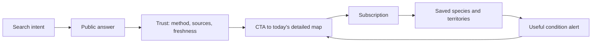

# Competitive growth roadmap

> Status: active implementation roadmap · 8 September 2026
>
> Baseline: `main` at `b1e60d8`
>
> Scope: public acquisition, product differentiation and retention. This does not
> replace prediction reliability work.

## Outcome

Boletada should not become a smaller mushroom encyclopedia. Its defensible
position is the service that best answers:

> **Where do conditions look promising now, what changed, and why?**

Public content should demonstrate that expertise using safe, aggregated outputs
from the model. The paid product keeps the resolution that makes a field decision
useful: heatmaps, exact cells, detailed rankings and point inspection.

## Competitive baseline

Public inspection on 7 September 2026 found that `bolets.app` combines a broad
editorial catalogue with current conditions and community features.

| Surface | `bolets.app` | Boletada baseline | Implication |
|---|---:|---:|---|
| Sitemap URLs | 217 | 27 | Boletada has a coverage gap, not an indexability failure |
| Species profiles | 62 | 27 after batch A | Expand selectively; accuracy matters more than matching volume |
| Territory URLs | 90 | 0 | Pilot a few data-rich regions before creating combinations at scale |
| Comparison URLs | 20 | 0 | High-value safety and identification intent is uncovered |
| Monthly season URLs | 12 + hub | One calendar hub | Month pages are a low-risk extension of structured data |
| Current-conditions landing | Yes | Paid app only | The largest high-intent acquisition opportunity |

Evidence snapshot:

- <https://bolets.app/sitemap.xml>
- <https://bolets.app/bolets-avui>
- <https://bolets.app/compare>
- <https://bolets.app/guies>
- <https://bolets.app/metode>
- <https://boletada.cat/sitemap.xml>

The competitor's breadth is evidence of search intent, not a page list to copy.
Every Boletada page must add original data, analysis or editorial value.

## Product and acquisition loop

## Product boundary

| Information | Public and indexable | Subscriber-only |
|---|---:|---:|
| Species, habitat, season and safety content | Yes | — |
| Daily generation time and data completeness | Yes | — |
| Coarse comarca-level condition band and explanation | Yes | — |
| Direction of change since the previous generation | Yes | — |
| Exact score, cell, coordinates or nearby named point | — | Yes |
| Heatmap and detailed spatial ranking | — | Yes |
| Point-level forest, soil and temperature drill-down | — | Yes |
| Saved territory/species alerts | — | Yes |

The public daily summary must not expose enough geometry or precision to recreate
the premium map. The formal payload is defined in
[`SEO_CONTENT_CONTRACT.md`](SEO_CONTENT_CONTRACT.md).

## Phased roadmap

Do not start a phase merely because the previous code was merged. Start it when
the preceding exit gate has been observed in production or explicitly waived.

| Phase | Deliverable | Why now | Exit gate |
|---:|---|---|---|
| 0 | Species foundation and first content batches | Build useful evergreen depth before multiplying routes | Five reference profiles use the mature template; new species ship in measured batches |
| 1 | Measurement and trust foundations | Establish a baseline and remove trust/architecture gaps | Search Console baseline recorded; conversion events work; method page indexed |
| 2 | Model-driven `/bolets-avui/` | Highest-intent bridge from search to paid map | Daily publication is atomic, fresh and never leaks premium resolution |
| 3 | Species comparisons | Capture safety intent using validated structured data | Entity split is backward-compatible; first five comparisons pass factual QA |
| 4 | Territory pilot | Test local intent without mass-producing thin pages | Six region pages have unique data and earn impressions/engagement before expansion |
| 5 | Season, habitat and category clusters | Broaden evergreen coverage around proven entities | Hubs improve discovery without cannibalising species pages |
| 6 | Retention loop | Turn value into repeat use rather than more anonymous traffic | Saved items and alerts demonstrate activation and retention lift |
| 7 | Optional expansion | Community tools, more territories, Spain | Separate business case, moderation plan and data coverage pass their gates |

### Phase 0 — species foundation and incremental coverage

#### GROWTH-001 · Mature the species profile

- Add a visible breadcrumb and matching `BreadcrumbList`.
- Put sourced field traits before habitat and season details.
- Label synthetic, illustrative or unverified images truthfully; they must never
  look like identification evidence.
- Keep source links, a truthful `updatedAt` date, safety language and a restrained
  map CTA.
- Validate the template first on rovelló, cep, rossinyol, ou de reig and farinera
  borda: two groups/edibles, a common confusion case and a mortal species.

#### GROWTH-002 · Expand in batches of three to five species

Each batch is one reviewable change and can be released independently. A species
is public when it is present in `content/catalog.json` on `main`; there is no
`draft` or `published` field. Work in progress stays on a branch.

| Batch | Proposed focus | Why |
|---|---|---|
| A | Llora aspra / blavet, cama-sec, molleric, fals rossinyol | Implemented on `codex/content-guide-batch-a`; the canonical Catalan name replaces the roadmap’s earlier use of the Spanish common name “carbonera” |
| B | Pinetell entity split, rovelló entity cleanup, lleterola de bedoll | Resolve the broad predictor group without blocking content coverage |
| C | More toxic/deadly confusion species | Strengthen safety coverage before scaling comparison pages |

After each batch: generate the HTML, run the catalogue/page tests, inspect one
desktop and one mobile profile, deploy, and measure indexing before the next one.

Recipes are a possible later extension once profile coverage and search demand
justify them. They are intentionally outside the current species-expansion scope.

### Phase 1 — measurement and trust

#### GROWTH-101 · Establish measurement

- Record Search Console clicks, impressions, queries and indexed pages by URL
  family before publishing new templates.
- Track `content_cta_view`, `content_cta_click`, `signup_start`, `checkout_start`
  and `subscription_active` with the source landing path.
- Define a weekly report by route family rather than judging individual new pages
  too early.

#### GROWTH-102 · Publish an open method page

Create `/com-es-calcula/` with:

- the difference between habitat compatibility and current conditions;
- input datasets and their freshness;
- scoring concepts without claiming certainty;
- known limitations, missing-data behavior and geographic resolution;
- model/version and last substantive review date;
- links to the map, species and responsible-use guidance.

#### GROWTH-103 · Strengthen entities and internal linking

- Add `WebSite` and `Organization` structured data on the homepage.
- Add visible breadcrumbs and `BreadcrumbList` to nested public pages.
- Give every species page contextual links to its season, habitats, comparisons
  and map entry.
- Generate truthful sitemap `lastmod` values from the profile's substantive
  `updatedAt` date.

### Phase 2 — public current conditions

#### GROWTH-201 · Generate `/bolets-avui/`

After a complete prediction generation is published, derive a separate public
snapshot. Render meaningful content into HTML; JavaScript may enhance it but must
not be required for indexing.

The page includes:

- successful generation date/time and freshness state;
- three to five leading comarques using qualitative bands;
- the leading in-season species per displayed comarca;
- direction of change from the previous comparable generation;
- one positive factor and one limiting factor when supported;
- a statement that conditions do not confirm presence;
- a CTA to the detailed subscriber map.

If input is stale or incomplete, preserve the last-good page with a visible
freshness warning. Never turn a failed scorer run into a misleading new page.

### Phase 3 — species entities and comparisons

#### GROWTH-301 · Separate editorial species from predictor groups

Split `Rovelló` (`Lactarius sanguifluus`) and `Pinetell`
(`Lactarius deliciosus`) into distinct catalogue entities. A prediction product
may still point both entities to a shared predictor group until separately modeled.
Keep the existing `/bolets/rovello/` canonical for rovelló and add a pinetell URL;
add redirects for any changed slug.

#### GROWTH-302 · Publish five validated comparisons

Initial set:

1. Rovelló vs pinetell
2. Rossinyol vs gírgola d'olivera
3. Ou de reig vs reig bord
4. Cep vs mataparent
5. Fredolic vs fredolic metzinós

Each page needs a real comparison table, discriminating traits, risk language,
photos with attribution, sources, factual QA and links to both complete profiles.

### Phase 4 — territory pilot

#### GROWTH-401 · Publish a `/zones/` hub and six regions

Pilot: Berguedà, Cerdanya, Ripollès, Solsonès, Garrotxa and Montseny.

Each page must contain unique aggregate evidence: habitat composition, meaningful
altitude bands, currently in-season species, daily qualitative conditions,
freshness and relevant official access/regulation links. Do not publish exact
collection points.

Do not create municipality × species pages until the pilot proves demand and the
indexability gate in the content contract passes.

### Phase 5 — evergreen clusters

#### GROWTH-501 · Month pages

Generate `/temporada/:mes/` for twelve months from reviewed season data. Add
current-condition context only when a fresh public snapshot exists.

#### GROWTH-502 · Habitat and category hubs

Start with pinedes, fagedes, alzinars and boscos de ribera, followed by
`/bolets-comestibles/` and `/bolets-toxics/`. These are navigational hubs, not
rewritten copies of every species description.

### Phase 6 — subscriber retention

#### GROWTH-601 · Saved searches and alerts

Allow a subscriber to save a species + coarse territory pair. Notify only when:

- the score crosses a configured band;
- the generation is fresh and sufficiently complete;
- a cooldown prevents repeated notifications;
- the user explicitly opted in.

Add a short “what changed” explanation using computed model factors. Test one
channel first; do not build native push, email and web push simultaneously.

### Phase 7 — optional bets

| Bet | Start only when |
|---|---|
| Private field notebook | Retention research shows users want to record outings |
| Public sightings | A moderation, privacy, abuse and cold-start plan exists |
| Municipality × species pages | Region pilot proves demand and each page has unique evidence |
| Spain expansion | Data coverage, language, regional profiles and operational cost are validated separately |

## Success metrics

| Layer | Primary metric | Guardrail |
|---|---|---|
| Discovery | Non-brand Search Console clicks to public content | Zero-impression pages do not grow without review |
| Engagement | Content → map CTA rate | No disclosure of premium map data |
| Activation | Signup and checkout starts attributed to content | Safety and uncertainty language remains visible |
| Revenue | New subscriptions attributed to organic entry pages | Refund/support rate does not worsen |
| Retention | Saved-item activation and alert return rate | Notification opt-out and complaint rate |
| Quality | Fresh successful daily publications | Stale/partial data is never presented as current |

## What not to do

- Do not publish hundreds of templated locality combinations in one release.
- Do not copy competitor prose, taxonomy, page structure or claims.
- Do not call a condition index a probability of finding mushrooms.
- Do not create identification claims without sources and editorial review.
- Do not migrate the public site to Next.js solely for SEO. Generated HTML can
  support this roadmap; keep any app frontend migration independent.
- Do not let content work delay prediction freshness, atomic publication or
  billing correctness.
