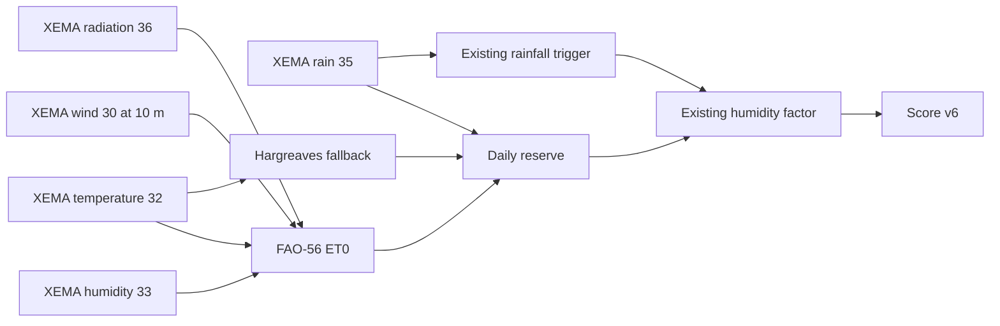

# Scoring model v6: dynamic moisture reserve

Status: active only on `development`/staging. Production `main` remains on score
v5 until the staging maps and comparison evidence are reviewed. Model v6 improves
the physical consistency of drying; it is not yet proof of better mushroom
occurrence predictions.

## What changes

The rainfall trigger is unchanged. Version 6 replaces only the 30-day fixed-decay
reserve with a 60-day, bounded daily water balance. It uses FAO-56 Penman–Monteith
reference evapotranspiration when the required XEMA variables have usable daily
coverage. If humidity, radiation, or wind is incomplete, it uses Hargreaves from
daily temperature extrema. If the daily series is insufficient, that station
explicitly falls back to the v5 reserve.



## Daily input contract

XEMA reports the selected variables every 30 minutes for the relevant automatic
stations, so a complete past day has 48 valid observations. The scorer excludes
invalid flags, deduplicates by observation ID in the aggregate query, preserves
zero rainfall, and never extrapolates the current partial day into a daily ET0.

| Field | Type | Meaning |
|---|---|---|
| `value` | `number \| null` | Daily sum for rain; daily mean otherwise |
| `min`, `max`, `mean` | `number \| null` | Daily extrema/mean in source units |
| `validObservationCount` | integer | Distinct valid source observations |
| `expectedObservationCount` | integer | 48 for these XEMA variables |
| `coverage` | number | Valid divided by expected |
| `latestValidObservationAt` | timestamp/null | Source freshness, not generation time |
| `quality` | complete/partial/missing/invalid | Explicit input state |
| `method` | observed | No synthetic source readings |

Rain and temperature must have observations no older than the previous calendar
day or publication fails and the prior atomic generation remains active. Upstream
requests have a 30-second timeout and one retry. Humidity, wind, and radiation are
optional because Hargreaves provides an explicit fallback.

## Water-balance contract

```text
effectiveRain[t] = min(max(rain[t], 0), 30 mm)
drying[t]        = ET0[t] * 0.65
reserve[t]       = clamp(reserve[t-1] + effectiveRain[t] - drying[t], 0, 100 mm)
reserveIndex[t]  = reserve[t] / 100 mm * 100
```

| Parameter | v6 value | Interpretation |
|---|---:|---|
| Warm-up | 60 complete past days | Avoid using the partial execution day |
| Initial reserve | 50 mm | Hypothesis; not measured soil moisture |
| Capacity | 100 mm | Shared exploratory root-zone capacity |
| Maximum effective daily rain | 30 mm | Excess cannot instantly fill more than this |
| Forest ET coefficient | 0.65 | Hypothesis reducing open-reference ET0 |
| Required usable-day coverage | 80% | Otherwise use the v5 station reserve |

Water above capacity is recorded as overflow. Missing days do not invent rain or
drying; they lower coverage and may cause the whole station to use the compatible
v5 reserve. Wind is converted from 10 m to 2 m using the FAO-56 equation, but an
open-station reading is still not a forest-floor wind measurement.

## Output and comparison

Every v6 generation includes `bolets.model-comparison.json`, with station/raster
score deltas, category transitions, baseline and candidate top areas, fallback
counts, observation freshness, and explicit limitations. The active raster and
GeoJSON advertise `scoreVersion: 6` and `moisture: dynamic-reserve-v1`.

The local 2026-09-07 replay used the candidate at 183 of 245 stations and the v5
fallback at 62. It used 5,537 FAO-56 station-days and 5,297 Hargreaves station-days.
Mean station score changes rounded to almost zero for every species; local raster
changes were larger and changed some top-area scores/locations. Two of the 2,205
station/species rows crossed a display-category threshold (one cep and one
rossinyol). This is suitable for visual staging review, not sufficient validation
for production.

## Release decision

Before merging to `main`, inspect wet/dry, coastal/mountain, and several dates;
compare map shape, top areas, discovery species, fallback rate, and category
transitions. Roll back staging by running the scorer with `--legacy-moisture` or
deploying the previous development commit. Production adoption requires an
explicit decision and a new generated v6 dataset.

Method references:

- [FAO-56 meteorological data and Penman–Monteith method](https://www.fao.org/4/X0490E/x0490e06.htm)
- [FAO-56 radiation calculations](https://www.fao.org/4/X0490E/x0490e07.htm)
- [FAO-56 ET0 calculation and Hargreaves fallback](https://www.fao.org/4/X0490E/x0490e08.htm)
- [Meteocat open-data service](https://www.meteo.cat/wpweb/serveis/dades-obertes/)
