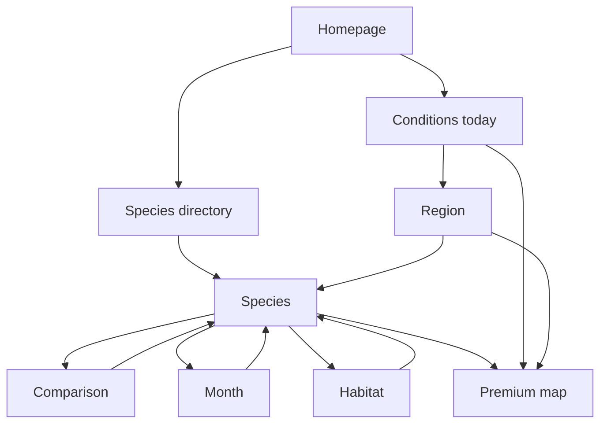

# SEO content and publication contract

> Companion specification for [`GROWTH_ROADMAP.md`](GROWTH_ROADMAP.md).  
> Status: proposed · 7 September 2026.

## Purpose

This contract prevents SEO expansion from producing thin pages, leaking paid map
data or publishing stale model output. It defines source data, route families,
indexability gates and the public/private boundary.

## Canonical sources

| Domain | Canonical source | Never infer from |
|---|---|---|
| Species identity and editorial claims | `content/catalog.json` plus cited sources | Predictor display labels alone |
| Current conditions | One complete active prediction generation | Partially written assets or browser state |
| Public regional summaries | Derived public snapshot defined below | Exact premium GeoJSON or nearest-cell endpoint |
| Publication/review date | Source-controlled editorial metadata | Build or deploy time |
| Generation freshness | Active generation manifest | Client clock or cached page date |

## Route contract

| Route family | Intent | Rendering | Index when | CTA |
|---|---|---|---|---|
| `/bolets/` | Browse species | Generated HTML | At least one reviewed profile exists | Species profiles and map |
| `/bolets/:slug/` | Understand one species | Generated HTML | Profile, source and review gates pass | Species or group map |
| `/comparar/:a-vs-b/` | Distinguish two species | Generated HTML | Both profiles and comparison review pass | Both profiles and map |
| `/temporada-de-bolets/` | Annual calendar | Generated HTML | Reviewed season data exists | Month and species pages |
| `/temporada/:mes/` | Mushrooms in one month | Generated HTML | Enough reviewed species create a useful answer | Current summary and profiles |
| `/boscos/:habitat/` | Species associated with a habitat | Generated HTML | Distinct habitat description and useful set exist | Profiles and map |
| `/zones/` | Browse regional summaries | Generated HTML | At least three approved regions exist | Region pages and map |
| `/zones/:region/` | Current and ecological regional overview | Generated HTML with public snapshot | Unique editorial and model-derived data pass gates | Detailed map |
| `/bolets-avui/` | Current conditions in Catalunya | Generated after complete scoring | Fresh public snapshot passes validation | Detailed map |
| `/com-es-calcula/` | Understand and trust the model | Generated HTML | Method, limits and sources are reviewed | Current summary and map |
| `/app/` | Use premium map | Client application | Never index | — |

## Public daily snapshot

The scorer publication process may derive a second, deliberately coarse artifact
after the private generation is complete. It must not contain coordinates,
geometry, cell identifiers, station-level ranks or exact condition scores.

```json
{
  "schemaVersion": 1,
  "generationId": "g-00000000-0000-4000-8000-000000000000",
  "generatedAt": "2026-09-07T04:15:00.000Z",
  "validForDate": "2026-09-07",
  "freshness": "fresh",
  "coverage": {
    "expectedSpecies": 9,
    "scoredSpecies": 9,
    "regionsEvaluated": 6
  },
  "regions": [
    {
      "slug": "bergueda",
      "name": "Berguedà",
      "conditionBand": "high",
      "trend": "improving",
      "leadingSpecies": ["cep", "rovello"],
      "positiveFactor": "recent-rain",
      "limitingFactor": "warm-temperature"
    }
  ]
}
```

### Validation rules

- `generationId` is the active complete generation used to derive the page.
- `freshness` is `fresh`, `stale` or `unavailable`; only `fresh` may use “avui”.
- A public region band is qualitative and cannot be reversed to an exact score.
- `leadingSpecies` contains catalogue slugs and only reviewed, edible or
  conditionally edible species.
- Factors use a controlled vocabulary backed by scorer evidence; omit rather than
  guess.
- Fewer than the expected species or regions makes the snapshot incomplete and
  prevents replacing the last-good public page.
- The public artifact is not an API for downloading premium data.

## Indexability gate

A generated URL defaults to `noindex` until every required check passes.

| Check | Species | Comparison | Month | Habitat | Region | Today |
|---|:---:|:---:|:---:|:---:|:---:|:---:|
| Unique search intent | ✓ | ✓ | ✓ | ✓ | ✓ | ✓ |
| Unique title, H1 and description | ✓ | ✓ | ✓ | ✓ | ✓ | ✓ |
| Canonical source data validates | ✓ | ✓ | ✓ | ✓ | ✓ | ✓ |
| Substantive non-boilerplate content | ✓ | ✓ | ✓ | ✓ | ✓ | ✓ |
| Human editorial review | ✓ | ✓ | ✓ | ✓ | ✓ | ✓ |
| Sources and safety language | ✓ | ✓ | ✓ | ✓ | ✓ | ✓ |
| Contextual internal links | ✓ | ✓ | ✓ | ✓ | ✓ | ✓ |
| Valid snapshot state for every current claim | — | — | — | — | ✓ | ✓ |
| No premium-resolution leakage | — | — | — | — | ✓ | ✓ |

Failure behavior:

| Situation | Response |
|---|---|
| Draft or incomplete evergreen page | Render preview with `noindex, nofollow`; omit from sitemap |
| Failed current generation | Keep last-good HTML and label it stale, or show unavailable; remove “avui” claims |
| Region lacks unique evidence | Do not create the URL |
| Slug changes | Permanent redirect old URL to the reviewed canonical URL |
| Duplicate intent across routes | Merge into the stronger page and redirect |

## Editorial entity model

Editorial species and prediction products are separate entities. This permits
accurate profiles while preserving a shared predictor during model migration.

```json
{
  "species": {
    "slug": "pinetell",
    "scientificName": "Lactarius deliciosus",
    "predictionProduct": "rovello-group",
    "publication": {
      "status": "published",
      "reviewedBy": "reviewer-id",
      "reviewedAt": "2026-09-07"
    }
  },
  "predictionProduct": {
    "key": "rovello-group",
    "memberSpecies": ["rovello", "pinetell"]
  }
}
```

Rules:

- Never describe a group prediction as a species-specific observation.
- A species page may link to a group map with explicit wording.
- Splitting a predictor requires a model/data decision, not merely a content edit.
- Comparison pages reference species entities, not prediction products.

## Minimum page anatomy

Every indexable nested page includes:

1. one descriptive H1 and a unique title/description;
2. visible breadcrumb navigation;
3. an answer to the primary intent before promotional content;
4. original structured information, not only rewritten prose;
5. sources, responsible-use language and review metadata;
6. two or more genuinely relevant contextual internal links;
7. a restrained CTA explaining the additional value of the paid map;
8. accessible images with attribution and truthful alternative text;
9. a self-referencing canonical and inclusion in the generated sitemap;
10. valid structured data matching visible content.

## Structured data policy

| Page | Structured data |
|---|---|
| Homepage | `WebSite`, `Organization`, `SoftwareApplication` |
| Directory/hub | `CollectionPage`, `ItemList`, `BreadcrumbList` where nested |
| Species/comparison/method | `Article`, `BreadcrumbList`; author/reviewer only when visible |
| Region/month/habitat | `CollectionPage` or `Article` according to visible content, plus `BreadcrumbList` |

Structured data is descriptive, not a promise of a rich result. Validate rendered
pages with Google's Rich Results Test and inspect a sample through Search Console
before scaling a template.

## Internal-link model



Avoid site-wide footer links to every generated page. Hubs and contextual links
must express the relationship and keep important pages within a few meaningful
clicks of the homepage.

## Release checklist for a new URL family

- [ ] Search intent and non-cannibalising canonical route documented.
- [ ] Data schema and invalid/missing-data behavior tested.
- [ ] One representative page reviewed in desktop and mobile layouts.
- [ ] Meaningful content is present without client-side JavaScript.
- [ ] Canonical, robots directive, sitemap and redirect behavior tested.
- [ ] Structured data matches visible content and validates.
- [ ] Sources, reviewer, safety and uncertainty wording reviewed.
- [ ] Analytics events include route family and CTA destination.
- [ ] A small pilot is indexed and measured before bulk generation.
- [ ] Rollback can remove the family from sitemap and set `noindex` without
      affecting the paid app.
